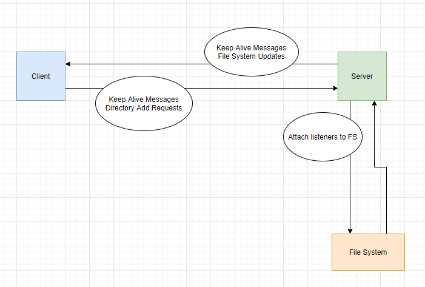
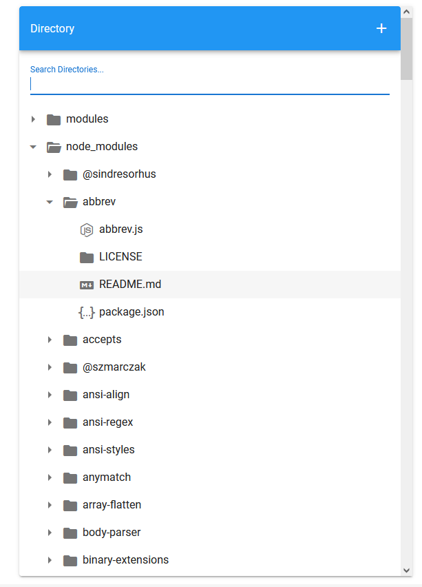
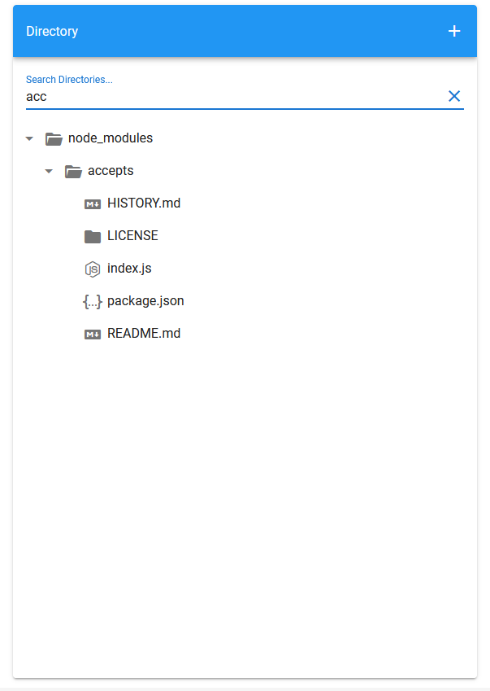
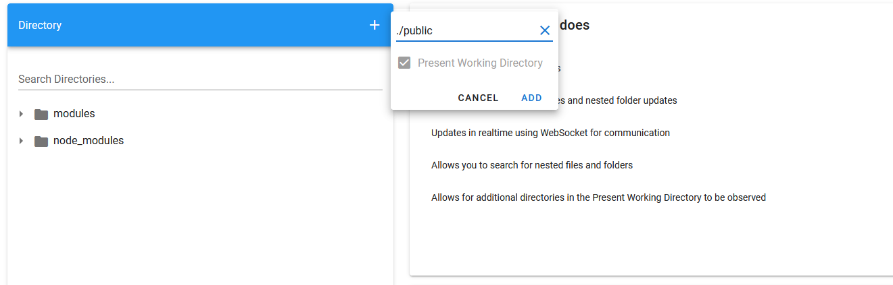
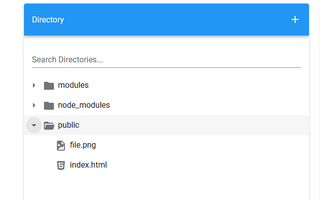

# File Explorer 2.0
## Vue & NodeJs In-Browser Files

## How it works
The script initializes an express server that serves the client a Vue.js frontend via via '/'(index.html), and sets up a websocket server alongside [chokidar](https://www.npmjs.com/package/chokidar) filesystem watchers. The chokidar package was chosen over native NodeJS file system watchers as they reduce CPU usage, and work cross platform (this project was developed exclusively on Windows 11). These watchers fire events on directory additions and removals (unlinks), as well as file additions and removals(unlinks). These events are then used to parse the path of the change, and send it along information dictating the change to the client via the websocket.




## Features

- Run with multiple paths to get real-time updates for your directories
- Send additional paths to the server to include more directories
- Search directories for files and folders

The intention behind this project was to create a lightweight in-browser directory monitor for file/folder creation and deletion.

## Libraries/Resources

- [Vue.js](https://vuejs.org/) - Lightweight and easy to use markdown/js
- [Vuetify](https://vuetifyjs.com/en/) - Material-UI component library for Vue.js
- [node.js] - V8 runtime for javascript 
- [Express] - lightweight framework, used for serving static files

## Installation and Setup

```sh
cd file-explorer
npm run start {paths}
```
Go to http://localhost:3000

## Examples
```sh
npm run start ./modules ./node_modules
```

List modules and node_modules, watching for updates  

  


Search currently loaded directories  

  


Prepare request to add a local directory to watch list  

  


Local directory added  


